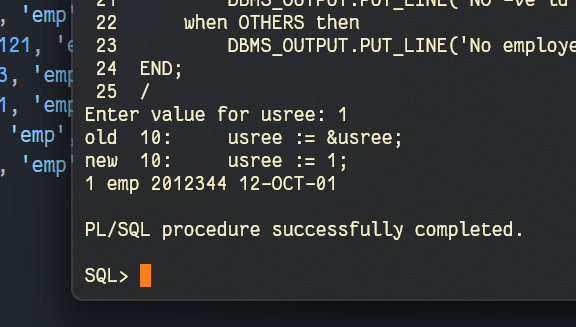
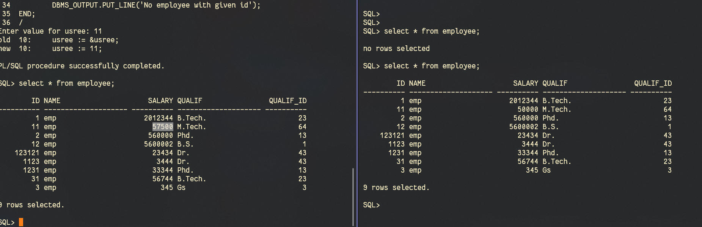
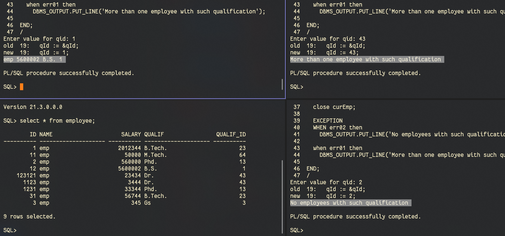
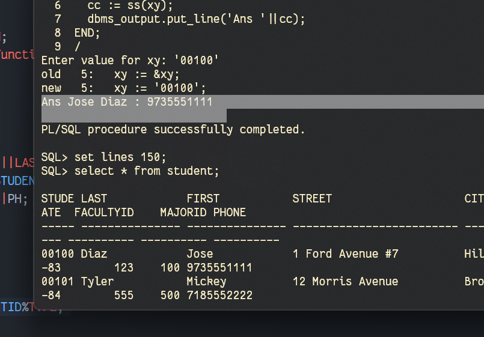
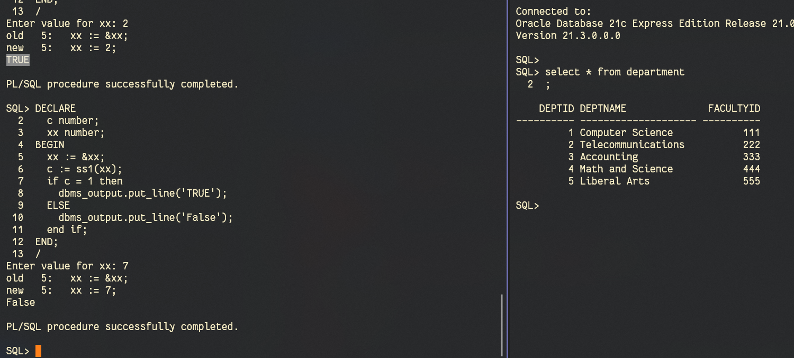
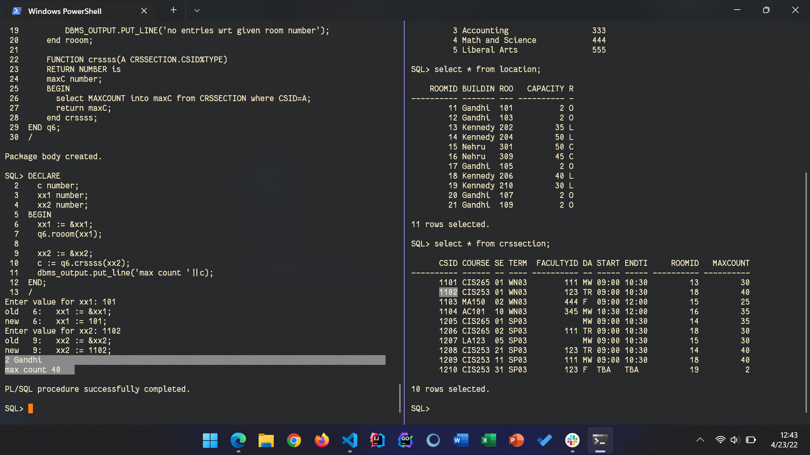

# DBMS Lab 11
`Author: Dipankar Das`

`Date: 23-4-2022`

`Roll: 20051554`

[Github Link](https://github.com/dipankardas011/DBMS)


## Question 1
Enter an employee id from the user. If it exists, display the detail, otherwise, show a user defined error.

### Solution
```sql
create table employee(
    id number,
    first varchar(20),
    salary number(10),
    hireDate date
);
set serveroutput ON;

insert into employee values(01, 'emp', 2012344, '12-Oct-2001');
insert into employee values(11, 'emp', 50000, '11-Mar-2021');
insert into employee values(02, 'emp', 560000, '17-May-1990');
insert into employee values(012, 'emp', 5600002, '17-Jun-1990');
insert into employee values(123121, 'emp', 23434, '1-Nov-2019');
insert into employee values(1123, 'emp', 3444, '12-Jan-2020');
insert into employee values(1231, 'emp', 33344, '21-Oct-2000');
insert into employee values(31, 'emp', 56744, '12-Oct-2001');
insert into employee values(100, 'emp', 345, '28-Feb-2022');

DECLARE
    IDID employee.id%type;
    ft employee.first%type;
    sall employee.salary%type;
    dat employee.hireDate%type;
    usree employee.id%type;
    errr EXCEPTION;
    cnt NUMBER;
BEGIN
    usree := &usree;
    select COUNT(*) into cnt from employee where usree=id;
    if cnt = 0 then
        RAISE errr;
    else
      select id, first, salary, hireDate into IDID, ft, sall, dat from employee where usree=id;
      DBMS_OUTPUT.PUT_LINE(IDID||' '||ft||' '||sall||' '||dat);
    end if;

EXCEPTION
    when errr then
        DBMS_OUTPUT.PUT_LINE('NO -ve id');
    when OTHERS then
        DBMS_OUTPUT.PUT_LINE('No employee with given id');
END;
```
### Output



## Question 2
Let empid 100 has been suspended from the company. Update the salary of the inputted empid with a increment of 15% except empid 100.
1. Show an error message for this type of exception.
1. Show an error code and error message for this.
1. Link the error code to the exception name.

### Solution

```sql
create table employee(
    id NUMBER,
    name VARCHAR(20),
    salary NUMBER,
    qualif VARCHAR(20),
    qualif_id NUMBER
);

insert into employee values(1, 'emp', 2012344, 'B.Tech.', 23);
insert into employee values(11, 'emp', 50000, 'M.Tech.', 64);
insert into employee values(2, 'emp', 560000, 'Phd.', 13);
insert into employee values(12, 'emp', 5600002, 'B.S.', 1);
insert into employee values(123121, 'emp', 23434, 'Dr.', 43);
insert into employee values(1123, 'emp', 3444, 'Dr.', 43);
insert into employee values(1231, 'emp', 33344, 'Phd.', 13);
insert into employee values(31, 'emp', 56744, 'B.Tech.', 23);
insert into employee values(3, 'emp', 345, 'Gs', 3);

set SERVEROUTPUT ON;
declare
    usree employee.id%type;
    baseEEE EMPLOYEE%ROWTYPE;
    CURSOR emp(usree employee.id%type) is select * from EMPLOYEE where usree = EMPLOYEE.id
        for update of SALARY nowait;
    errr EXCEPTION;
    invID EXCEPTION;
    PRAGMA EXCEPTION_INIT(invID, -20000);
begin
    usree := &usree;
    if usree = 100 then
        RAISE invID;
    end if;

    OPEN emp(usree);
    
    
    if emp%ISOPEN then
        fetch emp into baseEEE;
        if emp%NOTFOUND then
            RAISE errr;
        end if;
        UPDATE employee SET SALARY=1.15*baseEEE.SALARY WHERE CURRENT OF emp;
    
    else
        DBMS_OUTPUT.PUT_LINE('unable to open cursor');
    end if;
    
    close emp;
EXCEPTION
    when invID then
        DBMS_OUTPUT.PUT_LINE(SQLERRM||' This employee is suspended');
    when errr then
        DBMS_OUTPUT.PUT_LINE('No employee with given id');
END;

select * from EMPLOYEE;
```
### Output



## Question 3
Write a PL/SQL block to retrieve employees from the EMPLOYEE table based on a qualification Id. If the qualification Id returns more than one row, handle the exception with the appropriate handler and print the message 'More than one employee with such qualification'. If the qualification Id returns no employee, handle the exception with the appropriate handler and display the message 'No employees with such qualification'. If the qualification Id returns one employee, then print that employee's name, qualification and salary (predefined server exception problem).

### Solution

```sql
create table employee(
    id NUMBER,
    name VARCHAR(20),
    salary NUMBER,
    qualif VARCHAR(20),
    qualif_id NUMBER
);

insert into employee values(1, 'emp', 2012344, 'B.Tech.', 23);
insert into employee values(11, 'emp', 50000, 'M.Tech.', 64);
insert into employee values(2, 'emp', 560000, 'Phd.', 13);
insert into employee values(12, 'emp', 5600002, 'B.S.', 1);
insert into employee values(123121, 'emp', 23434, 'Dr.', 43);
insert into employee values(1123, 'emp', 3444, 'Dr.', 43);
insert into employee values(1231, 'emp', 33344, 'Phd.', 13);
insert into employee values(31, 'emp', 56744, 'B.Tech.', 23);
insert into employee values(3, 'emp', 345, 'Gs', 3);

SET SERVEROUTPUT ON;
DECLARE
  nam EMPLOYEE.NAME%type;
  qId EMPLOYEE.QUALIF_ID%type;
  sall EMPLOYEE.SALARY%type;
  qualif EMPLOYEE.QUALIF%type;

  nam1 EMPLOYEE.NAME%type;
  qId1 EMPLOYEE.QUALIF_ID%type;
  sall1 EMPLOYEE.SALARY%type;
  qualif1 EMPLOYEE.QUALIF%type;

  CURSOR curEmp(qId EMPLOYEE.QUALIF_ID%TYPE) is 
    select NAME, SALARY, QUALIF, QUALIF_ID
      from EMPLOYEE WHERE qId = QUALIF_ID;
  err01 EXCEPTION;
  err02 EXCEPTION;

BEGIN
  qId := &qId;
  OPEN curEmp(qId);
  IF curEmp%ISOPEN THEN
    fetch curEmp into nam, sall, qualif, qId;
    IF curEmp%NOTFOUND THEN
      RAISE err02;
    END IF;

    fetch curEmp into nam1, sall1, qualif1, qId1;
    IF curEmp%FOUND THEN
      RAISE err01;
    ELSE
      DBMS_OUTPUT.PUT_LINE(nam||' '||sall||' '||qualif||' '||qId);
    END IF;
    
  ELSE
    DBMS_OUTPUT.PUT_LINE('unable to open cursor');
  END IF;
  close curEmp;

  EXCEPTION
  WHEN err02 then
    DBMS_OUTPUT.PUT_LINE('No employees with such qualification');

  when err01 then
    DBMS_OUTPUT.PUT_LINE('More than one employee with such qualification');

END;
```

### Output



## Question 4
Write a procedure that is passed a students identification number and returns back the students full name and phone number from the STUDENT table to the calling program. Also write an anonymous block with the procedure call.

### Solution

```sql
SET SERVEROUTPUT ON;
create or replace function ss(A CHAR) 
RETURN VARCHAR is
  NAM VARCHAR(40);
  PH CHAR(10);
  re VARCHAR(80);
BEGIN
  SELECT FIRST||' '||LAST, PHONE INTO NAM, PH FROM STUDENT
    WHERE STUDENT.STUDENTID=A;
  re := NAM||' : '||PH;
  return re;
END ss;

DECLARE
  cc VARCHAR(80);
  xy student.STUDENTID%TYPE;
BEGIN
  xy := &xy;
  cc := ss(xy);
  dbms_output.put_line('Ans '||cc);
END;
```

### Output



## Question 5
Write a function and pass a department number to it. If the DEPT table does not contain that department number, return a FALSE value, otherwise return a TRUE value.Print the appropriate message in the calling program based on the result.

### Solution

```sql
SET SERVEROUTPUT ON;
create or replace function ss1(A number) 
RETURN number is
  dd NUMBER;
  xyz BOOLEAN;
BEGIN
  select count(*) into dd from department where A=DEPTID;
  if dd = 0 then
    xyz := false;
  else
    xyz := true;
  end if;
  return dd;
END ss1;

DECLARE 
  c number;
  xx number;
BEGIN
  xx := &xx;
  c := ss1(xx);
  if c = 1 then 
    dbms_output.put_line('TRUE');
  ELSE
    dbms_output.put_line('False');
  end if;
END; 
```

### Output


## Question 6
Write a package that contains a procedure and a function. The procedure is passed a room number. If the room number exists, the procedure gets the capacity of the room and the building name from the LOCATION table. If the room number does not exist, the procedure performs the appropriate exception-handling routine. The function is passed a csid and returns maximum number of seats available in the course section.

### Solution

```sql
set SERVEROUTPUT on;


CREATE OR REPLACE PACKAGE q6 AS
  procedure rooom(A location.ROOMNO%TYPE);
  FUNCTION crssss(A CRSSECTION.CSID%TYPE) return NUMBER;
end q6;

CREATE OR REPLACE PACKAGE BODY q6 AS

    procedure rooom(A location.ROOMNO%TYPE) 
    is
      dd NUMBER;
      errr EXCEPTION;
      cappp LOCATION.CAPACITY%type;
      bbb LOCATION.BUILDING%type;

    begin
      select count(*) into dd from location where LOCATION.ROOMNO=A;
      if dd = 0 THEN
        raise errr;
      end if;
      select CAPACITY, BUILDING into cappp, bbb from location where LOCATION.ROOMNO=A;
      dbms_output.PUT_LINE(cappp||' '||bbb);
    EXCEPTION
      when errr then
        DBMS_OUTPUT.PUT_LINE('no entries wrt given room number');
    end rooom;

    FUNCTION crssss(A CRSSECTION.CSID%TYPE)
    RETURN NUMBER is
    maxC number;
    BEGIN
      select MAXCOUNT into maxC from CRSSECTION where CSID=A;
      return maxC;
    end crssss;
END q6;
```

### Output

