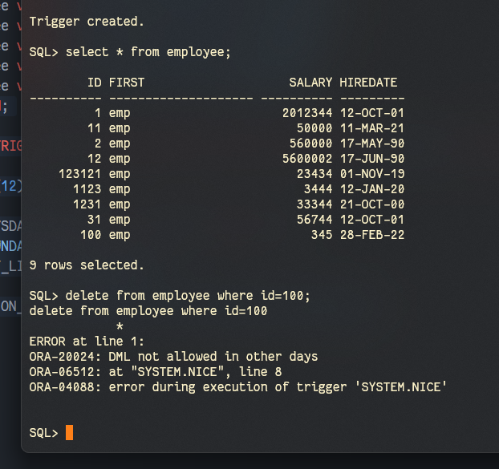
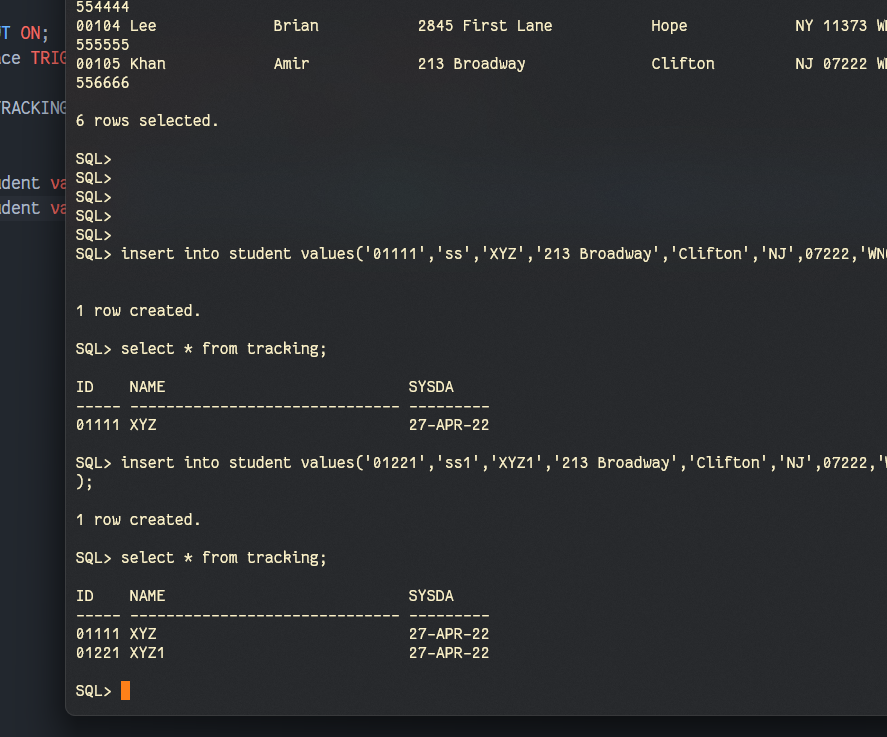
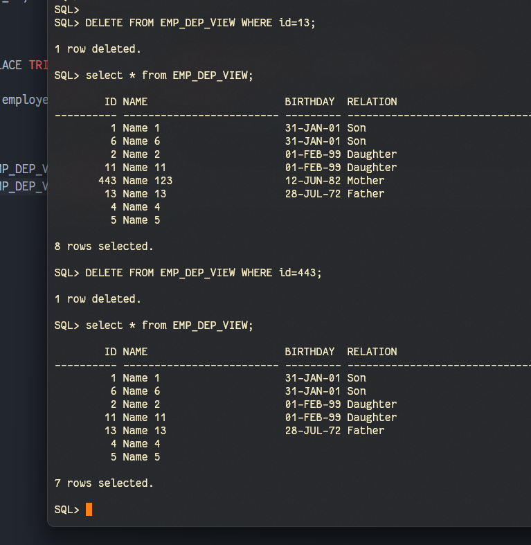

# DBMS Lab 12
`Author: Dipankar Das`

`Date: 27-4-2022`

`Roll: 20051554`

[Github Link](https://github.com/dipankardas011/DBMS)


## Question 1
Write a trigger that is fired before the DML statement's execution on the EMPLOYEE table. The trigger checks the day based on SYSDATE. If the day is Sunday, the trigger does not allow the DML statements execution and raises an exception. Write the appropriate message in the exception-handling section.

### Solution
```sql
create table employee(
    id number,
    first varchar(20),
    salary number(10),
    hireDate date
);

insert into employee values(01, 'emp', 2012344, '12-Oct-2001');
insert into employee values(11, 'emp', 50000, '11-Mar-2021');
insert into employee values(02, 'emp', 560000, '17-May-1990');
insert into employee values(012, 'emp', 5600002, '17-Jun-1990');
insert into employee values(123121, 'emp', 23434, '1-Nov-2019');
insert into employee values(1123, 'emp', 3444, '12-Jan-2020');
insert into employee values(1231, 'emp', 33344, '21-Oct-2000');
insert into employee values(31, 'emp', 56744, '12-Oct-2001');
insert into employee values(100, 'emp', 345, '28-Feb-2022');
set serveroutput ON;

CREATE OR REPLACE TRIGGER nice BEFORE INSERT OR DELETE OR UPDATE ON employee FOR EACH ROW
DECLARE
  currDate varchar(12);
BEGIN
  SELECT TO_CHAR(SYSDATE, 'DAY') INTO currDate FROM dual;
  IF currDate = 'SUNDAY' THEN
    DBMS_OUTPUT.PUT_LINE('Its Allowed');
  ELSE
    RAISE_APPLICATION_ERROR(-20024,'DML not allowed in other days');
  END IF;
END;

```
### Output



## Question 2
Write a trigger that is fired after an INSERT statement is executed for the STUDENT table. The trigger writes the new students ID, users name, and systems date in a table called TRACKING. (Note: You must create the TRACKING table first).

### Solution

```sql
-- select user from dual;
create table TRACKING(
  id char(5),
  name varchar2(30),
  SySda date
);
set SERVEROUTPUT ON;
create or replace TRIGGER q2 after insert on student FOR EACH row
BEGIN
  insert into TRACKING values(:NEW.STUDENTID, :NEW.FIRST, SYSDATE);
END;

insert into student values('01111','ss','XYZ','213 Broadway','Clifton','NJ',07222,'WN03','07-JUL-84', 222, 200,'2015556666');
insert into student values('01221','ss1','XYZ1','213 Broadway','Clifton','NJ',07222,'WN03','07-JUL-84', 222, 200,'2015556666');
```
### Output



## Question 3
Create a complex view EMP_DEP_VIEW using an outer join between EMPLOYEE and DEPENDENT table with employee names, dependents birthdate and relation.  The outer join will also return employees without any dependents.  Now, create an INSTEAD OF trigger based on EMP_DEP_VIEW to enable you to delete employee 433 through view.

### Solution

```sql
create table dependent(
  d_id number PRIMARY KEY,
  birthday date NOT NULL,
  relation varchar2(35) NOT NULL
);
create table employee(
    id number PRIMARY KEY,
    d_id number NULL,
    name varchar2(25) NOT NULL
);

insert into dependent VALUES(11, '31-Jan-2001', 'Son');
insert into dependent VALUES(12, '1-Feb-1999', 'Daughter');
insert into dependent VALUES(13, '12-Jun-1982', 'Mother');
insert into dependent VALUES(14, '28-July-1972', 'Father');

insert into employee VALUES(1, 11, 'Name 1');
insert into employee VALUES(2, 12, 'Name 2');
insert into employee VALUES(4, NULL, 'Name 4');
insert into employee VALUES(5, NULL, 'Name 5');
insert into employee VALUES(6, 11, 'Name 6');
insert into employee VALUES(11, 12, 'Name 11');
insert into employee VALUES(443, 13, 'Name 123');
insert into employee VALUES(13, 14, 'Name 13');

set SERVEROUTPUT ON;
CREATE OR REPLACE VIEW EMP_DEP_VIEW AS SELECT e.id, e.name, d.birthday, d.relation
  FROM employee e LEFT OUTER JOIN dependent d ON
    d.d_id=e.d_id;


CREATE OR REPLACE TRIGGER view_deleter INSTEAD OF DELETE ON EMP_DEP_VIEW FOR EACH ROW
BEGIN
  DELETE FROM employee WHERE id=:OLD.id AND :OLD.id=443;
END;


DELETE FROM EMP_DEP_VIEW WHERE id=13;
DELETE FROM EMP_DEP_VIEW WHERE id=443;
```

### Output


